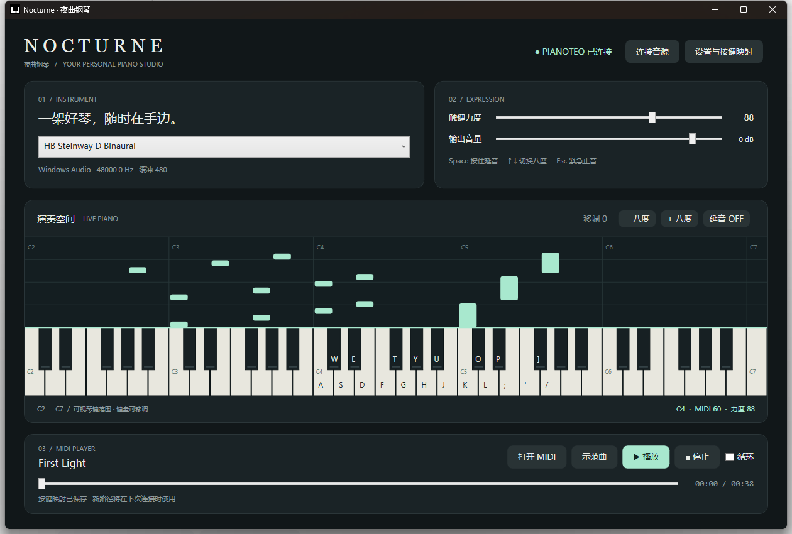

# Nocturne · 夜曲钢琴

Nocturne 是一款为 **Pianoteq 9** 制作的 Windows 桌面钢琴程序。它把电脑键盘变成可配置的演奏键盘，并提供 MIDI 自动演奏、音符瀑布、琴键高亮、音色选择、延音与移调等功能。



> 本项目由 **OpenAI GPT-6** 设计、开发并完成测试。

## 主要功能

- 直接连接本机已经激活的 Pianoteq 9，使用已有音源与授权音色
- 电脑键盘与鼠标实时演奏，支持多键和弦
- 自定义按键映射，支持保存、恢复默认、导入和导出
- MIDI Format 0 / 1 自动演奏，支持多音轨、速度变化、暂停、跳转和循环
- 音符瀑布与实时琴键高亮
- 触键力度、输出音量、延音踏板和上下八度控制
- 窗口失焦自动释放手动音符，`Esc` 紧急止音
- 单实例运行，避免重复打开控制窗口

## 运行要求

- Windows 10 或 Windows 11
- [.NET 8 Desktop Runtime](https://dotnet.microsoft.com/download/dotnet/8.0)
- 已安装并激活的 Pianoteq 9

默认音源路径为：

```text
D:\Music\Modartt\Pianoteq 9\Pianoteq 9.exe
```

路径不同也没关系，可在程序右上角的“设置与按键映射”中修改。

## 快速开始

1. 双击 `启动夜曲钢琴.lnk`，或运行 `App/Nocturne.exe`。
2. 等待右上角显示“PIANOTEQ 已连接”。
3. 使用电脑键盘或鼠标开始演奏。
4. 点击“打开 MIDI”，也可以将 `.mid` / `.midi` 文件拖入窗口自动演奏。

程序启动时会载入原创示范曲 **First Light**，但不会自动播放。

## 默认键位

中央 C（C4）从 `A` 开始：

```text
黑键： W  E     T  Y  U     O  P     ]
白键： A  S  D  F  G  H  J  K  L  ;  '  /
```

- `Space`：按住延音
- `↑` / `↓`：上下移调一个八度
- `Esc`：停止 MIDI 并立即止音

按键可以在设置窗口中重新绑定。支持字母、数字、常用标点和数字小键盘，映射范围为 MIDI 21–108（A0–C8）。

## MIDI 播放

Nocturne 使用 Pianoteq 自带的 MIDI 播放器保证节拍稳定，同时解析 MIDI 文件来绘制音符瀑布。支持：

- Standard MIDI File Format 0 / 1
- 多音轨与跨轨速度事件
- Running Status 与零力度 Note On
- PPQ 和 SMPTE 时间格式
- 播放、暂停、停止、进度跳转与循环

单个 MIDI 文件大小上限为 32 MB。Format 2 文件需要先转换成 Format 0 或 1。

## 与 Pianoteq 的连接

程序通过仅监听本机的 `127.0.0.1:18981` JSON-RPC 接口控制 Pianoteq 9，不需要安装虚拟 MIDI 驱动。音频设备、驱动、采样率和缓冲大小仍在 Pianoteq 中设置。

如果已连接但没有声音，请检查 Pianoteq 的音频输出设备和 Windows 系统音量。

## 从源码构建

项目使用 C#、WPF 和 .NET 8，不依赖第三方 NuGet 包。

```powershell
dotnet publish src/Nocturne.csproj -c Release -o App
```

也可以直接运行根目录的 `build.cmd`。

## 测试

运行基础测试：

```text
test.cmd
```

在 Pianoteq 可用时运行真实音源集成测试：

```text
test.cmd --integration
```

项目已经验证 MIDI 解析、真实音符与踏板指令、MIDI 播放/暂停/跳转/循环、键盘演奏、映射保存和单实例启动。测试结果可见 `验证结果.txt`。

## 项目结构

```text
Nocturne Piano/
├─ App/                 编译后的 Windows 程序
├─ Music/               原创示范 MIDI
├─ src/                 C# / WPF 源码
├─ settings.json        默认键位与程序设置
├─ build.cmd            编译脚本
├─ test.cmd             测试脚本
├─ 使用说明.md          完整中文使用说明
└─ 启动夜曲钢琴.lnk     桌面启动快捷方式
```

## 说明

Pianoteq 是 Modartt 的产品与商标。本项目不是 Modartt 官方软件，不包含 Pianoteq 程序、音源或许可证；使用者需要自行合法安装并激活 Pianoteq。

