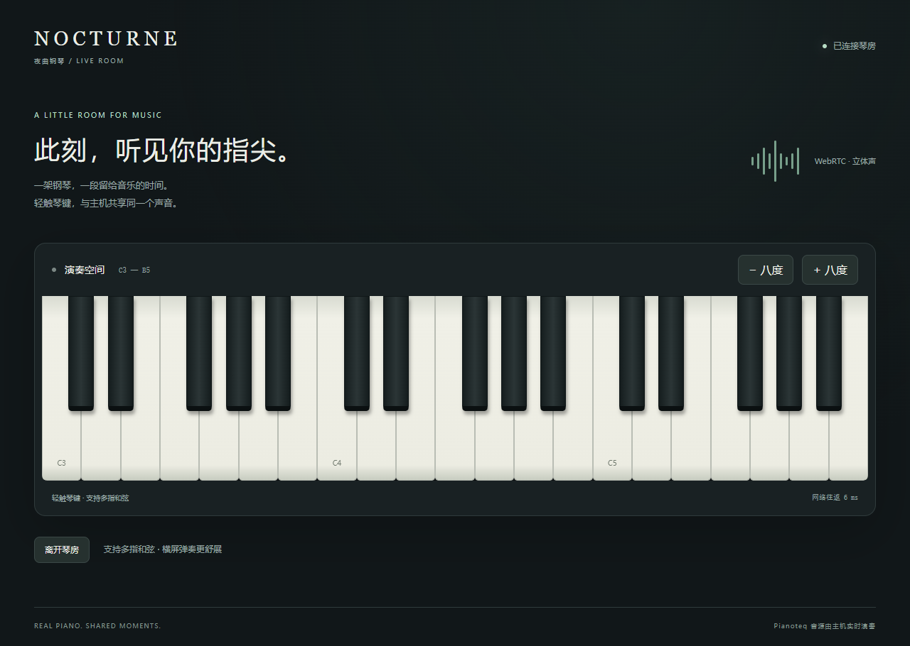

# Nocturne · 夜曲钢琴

Nocturne 是一款为 **Pianoteq 9** 制作的 Windows 桌面钢琴程序。它把电脑键盘变成可配置的演奏键盘，并提供 MIDI 自动演奏、音符瀑布、琴键高亮、音色选择、延音与移调等功能。


> 本项目由 **OpenAI GPT-6** 设计、开发并完成测试。

## 主要功能

- 直接连接本机已经激活的 Pianoteq 9，使用已有音源与授权音色
- 电脑键盘与鼠标实时演奏，支持多键和弦
- 自定义按键映射，支持保存、恢复默认、导入和导出
- MIDI Format 0 / 1 自动演奏，支持多音轨、速度变化、暂停、跳转和循环
- 音符瀑布与实时琴键高亮
- F9 一键从头播放并录制整首 MIDI，自动保存纯钢琴 WAV 音频
- 浏览器琴房：电脑、手机触摸琴键，接收主机当前钢琴声音；WebRTC 立体声优先，自动兼容 WebSocket 网页穿透
- 触键力度、输出音量、延音踏板和上下八度控制
- 窗口失焦自动释放手动音符，`Esc` 紧急止音
- 单实例运行，避免重复打开控制窗口

## 运行要求

- Windows 10 或 Windows 11
- [.NET 8 Desktop Runtime](https://dotnet.microsoft.com/download/dotnet/8.0)
- 同一下载页中的 **ASP.NET Core Runtime 8（x64）**，供内置浏览器服务使用
- 已安装并激活的 Pianoteq 9

浏览器共享的独立进程音频采集需要 **Windows 11**（或 Windows build 20348 以上），音源需使用 Windows 共享音频输出；ASIO / 独占输出不保证可被采集。

默认音源路径为：

```text
D:\Music\Modartt\Pianoteq 9\Pianoteq 9.exe
```

路径不同也没关系，可在程序右上角的“设置与按键映射”中修改。

## 快速开始

1. 双击 `启动夜曲钢琴.lnk`，或运行 `App/Nocturne.exe`。
2. 等待右上角显示“PIANOTEQ 已连接”。
3. 使用电脑键盘或鼠标开始演奏。
4. 点击“打开 MIDI”，也可以将 `.mid` / `.midi` 文件拖入窗口自动演奏。

程序启动时会载入原创示范曲 **First Light**，但不会自动播放。

## 默认键位

中央 C（C4）从 `A` 开始：

```text
黑键： W  E     T  Y  U     O  P     ]
白键： A  S  D  F  G  H  J  K  L  ;  '  /
```

- `Space`：按住延音
- `↑` / `↓`：上下移调一个八度
- `Esc`：停止 MIDI 并立即止音

按键可以在设置窗口中重新绑定。支持字母、数字、常用标点和数字小键盘，映射范围为 MIDI 21–108（A0–C8）。

## MIDI 播放

Nocturne 使用 Pianoteq 自带的 MIDI 播放器保证节拍稳定，同时解析 MIDI 文件来绘制音符瀑布。支持：

- Standard MIDI File Format 0 / 1
- 多音轨与跨轨速度事件
- Running Status 与零力度 Note On
- PPQ 和 SMPTE 时间格式
- 播放、暂停、停止、进度跳转与循环

单个 MIDI 文件大小上限为 32 MB。Format 2 文件需要先转换成 Format 0 或 1。

## 一键录制整曲音频

选择 MIDI 后，按 **F9** 或点击 **“录制整曲”**，程序会从头播放一遍，并在播放完成后自动保存 WAV：

- 保存位置：项目文件夹下的 `Recordings/`，文件名包含曲名和时间，避免覆盖已有录音。
- 格式：48 kHz、24-bit PCM WAV，保留音源输出声道和钢琴自然尾音。
- 使用开始录制时的当前音色设置及音量快照，按照 MIDI 原有音符、力度和速度生成音频。
- **声音直接由 Pianoteq 渲染，不采集声卡回放或麦克风，因此不会混入通知、聊天、浏览器或其他程序的声音。**
- 录制期间锁定切歌、移调和手动演奏，并忽略夜曲钢琴的循环选项；窗口失焦仍会继续录制。
- 再按 **F9**、按 **Esc** 或点击“取消录制”会取消任务，不保存不完整音频。
- 点击 **“打开录音文件夹”** 可查看保存结果。

该功能生成的是所选 MIDI 的完整钢琴演奏音频，不用于录制临场键盘演奏。录制时请勿在 Pianoteq 自身窗口中暂停、停止或更改播放；播放中断会报错并取消保存。

可运行 `App/Nocturne.exe --self-test --recording` 进行整曲录制集成测试（会实际播放原创示范曲，请先关闭主程序）。

## 与 Pianoteq 的连接

程序通过仅监听本机的 `127.0.0.1:18981` JSON-RPC 接口控制 Pianoteq 9，不需要安装虚拟 MIDI 驱动。音频设备、驱动、采样率和缓冲大小仍在 Pianoteq 中设置。

如果已连接但没有声音，请检查 Pianoteq 的音频输出设备和 Windows 系统音量。

## 浏览器琴房与内网穿透



[查看手机页面](docs/browser-piano-mobile.png)

1. 主机连接 Pianoteq 后，点击右上角 **“浏览器共享” → “开启共享”**。
2. 点击 **“本机浏览器试听”**，在网页点击 **“进入琴房”** 开启声音。鼠标和手机多指触摸均可弹奏，网页可切换八度。
3. 你的内网穿透服务指向 **`http://127.0.0.1:18982`**，开启 **WebSocket** 支持，并为外网入口配置 **HTTPS**。
4. 把邀请链接里的 `http://127.0.0.1:18982` 替换成公网域名，保留 `/#key=…`。访问者需要完整邀请链接。反向代理应保留原始 `Host`，以通过同源检查。
5. **“关闭共享”** 会断开所有访问者并废除邀请密钥。默认不自动开启共享；勾选“允许局域网访问”才会监听所有网卡。

网页只允许演奏琴键和接收声音，不能打开本机文件、修改音色、播放 MIDI 或操作录音。最多 8 位访问者共用同一架钢琴，听到的也包括主机正在播放的 MIDI。开始 F9 录制后，远程琴键暂停输入，但可继续聆听，结束后恢复。

音频通过 Windows **Pianoteq 进程回环采集**，不采集麦克风或整个桌面的声音。WebRTC 使用 **48 kHz / 双声道 Opus，192 kbps，10 ms 音频帧**；琴键优先使用低延迟 DataChannel，带状态刷新、序号校验和断线自动松键。备用通道使用 WebSocket + PCM16 立体声，浏览器通过有界 AudioWorklet 缓冲播放，音频净带宽约 **1.54 Mbps / 人**。

HTTP 穿透不等于 WebRTC 的 UDP 穿透。能直连时会自动使用 WebRTC；复杂 NAT 或运营商网络可以在共享窗口填写自己的 **TURN 地址、用户名和密码**。无法建立 WebRTC 时网页仍可使用备用通道，但丢包较多时 TCP 重传可能增加延迟。网页的“网络往返”只表示网络 RTT，不是完整触键到出声延迟。远距离网络与蓝牙耳机也会增加延迟，实时弹奏优先使用有线耳机。

共享配置保存于 `remote-settings.json`，已加入 Git 忽略；邀请密钥仅在内存中生成，每次开启更换。没有分发 Pianoteq 程序或音色文件，使用 Pianoteq 仍受其自身授权条款约束。

完整配置和排错见 [浏览器共享说明](docs/browser-sharing.md)。

## 从源码构建

项目使用 C#、WPF、ASP.NET Core 和 .NET 8。音频与 WebRTC 使用 NAudio.Wasapi、SIPSorcery 及其依赖；首次构建需联网还原 NuGet 包。

```powershell
dotnet publish src/Nocturne.csproj -c Release -o App
```

也可以直接运行根目录的 `build.cmd`。

## 测试

运行基础测试：

```text
test.cmd
```

在 Pianoteq 可用时运行真实音源集成测试：

```text
test.cmd --integration
```

项目已经验证 MIDI 解析、真实音符与踏板指令、MIDI 播放/暂停/跳转/循环、键盘演奏、映射保存和单实例启动。测试结果可见 `验证结果.txt`。

## 项目结构

```text
Nocturne Piano/
├─ App/                 编译后的 Windows 程序
├─ Music/               原创示范 MIDI
├─ src/                 C# / WPF 源码
├─ settings.json        默认键位与程序设置
├─ LICENSE              MIT 开源许可证
├─ build.cmd            编译脚本
├─ test.cmd             测试脚本
├─ 使用说明.md          完整中文使用说明
└─ 启动夜曲钢琴.lnk     桌面启动快捷方式
```

## 许可证

Nocturne 的原创代码以 [MIT License](LICENSE) 发布。

MIT License 只适用于本仓库拥有版权的原创内容，不授予任何第三方软件、商标、音源、预设、MIDI 作品或其他第三方内容的权利。

新增依赖遵循各自许可证，见 [THIRD-PARTY-NOTICES.md](THIRD-PARTY-NOTICES.md) 和 [完整许可文本](third-party-licenses/)。其中 SIPSorcery 的许可包含额外使用限制，不能将该依赖描述为无附加限制的 MIT / BSD 软件。

## 商标与非隶属声明

- **Pianoteq** 是 **Modartt S.A.S.** 的商标或注册商标。本项目与 Modartt S.A.S. 不存在隶属、赞助、认证或官方认可关系。
- **OpenAI** 和 **GPT** 是 OpenAI 的商标。本项目的初始实现由 gentleMar 使用 OpenAI GPT-6 / Codex 辅助完成；本项目与 OpenAI 不存在隶属、赞助、认证或官方认可关系。
- 文中出现的第三方产品名称只用于说明兼容性和识别对应产品，相关权利归各自权利人所有。

本项目不包含 Pianoteq 程序、音源、预设或许可证。使用者需要自行合法安装并激活 Pianoteq。
